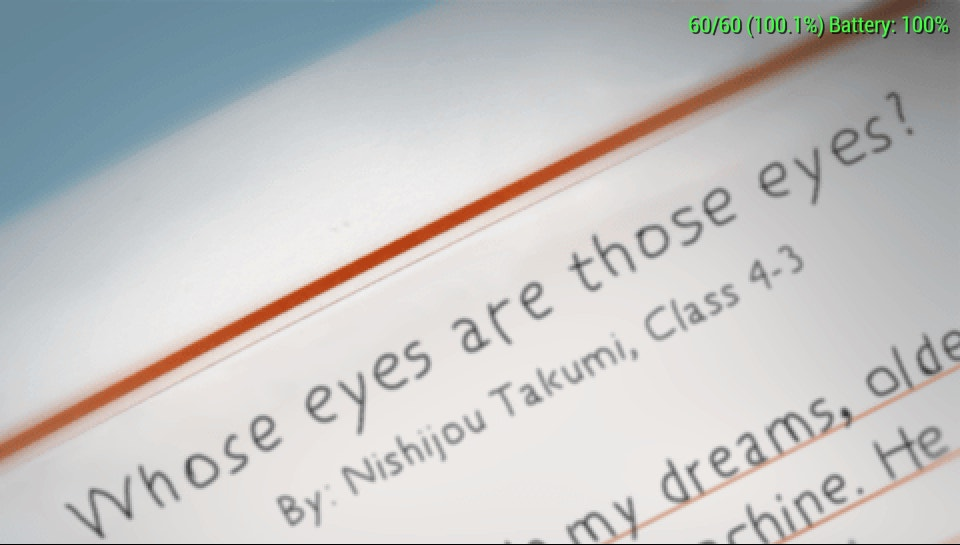
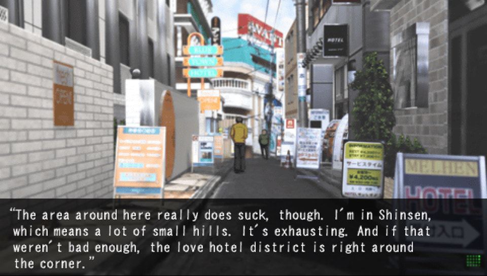
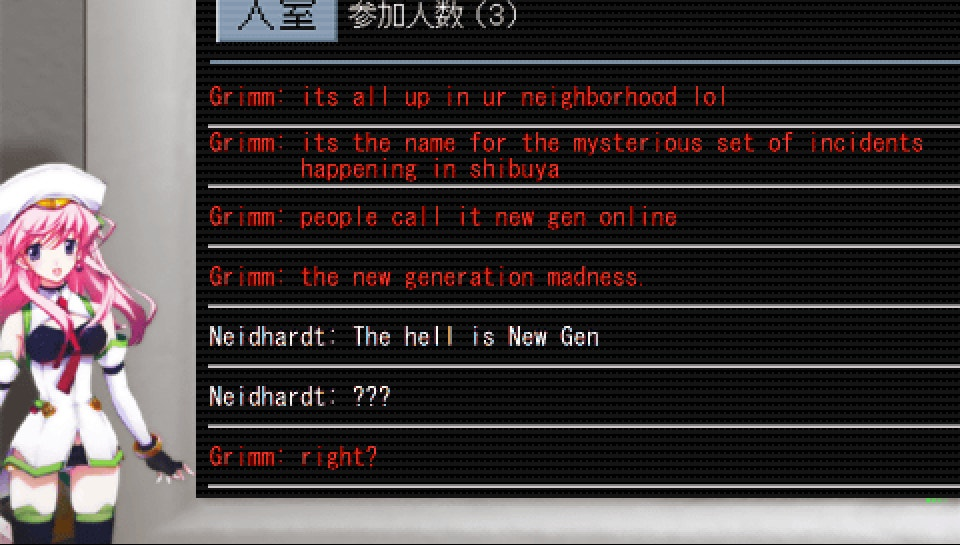
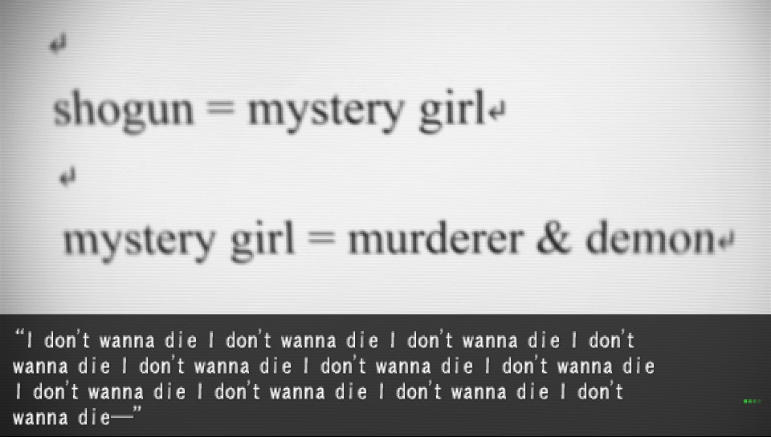
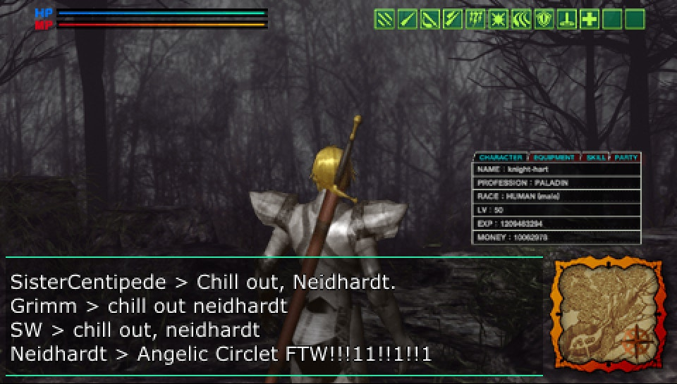
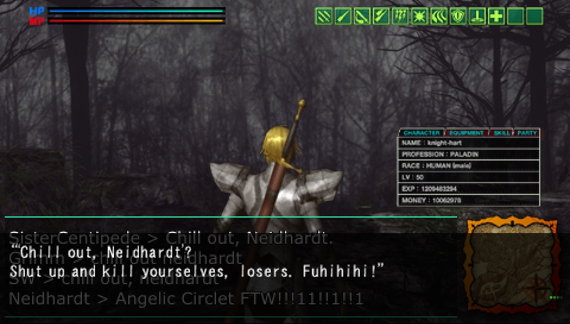
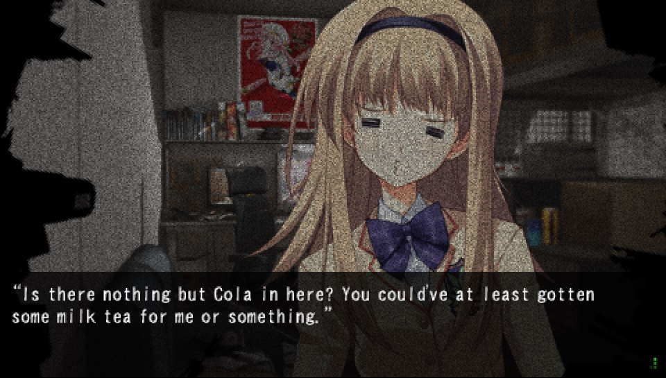
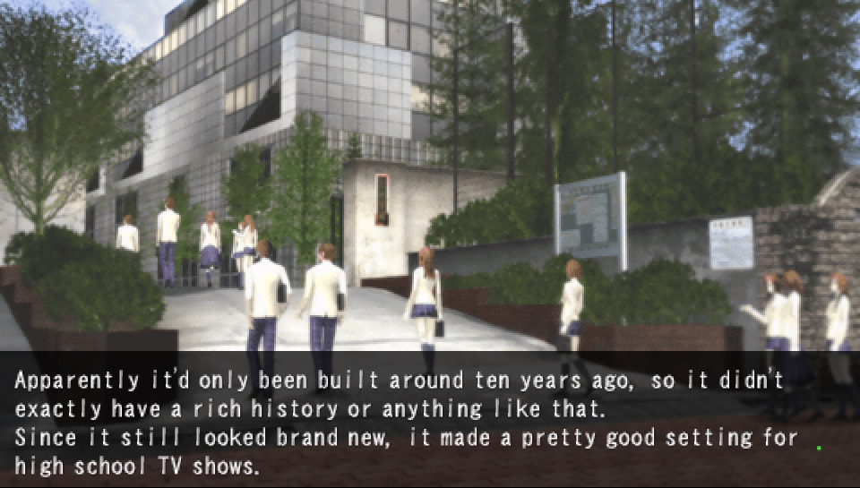
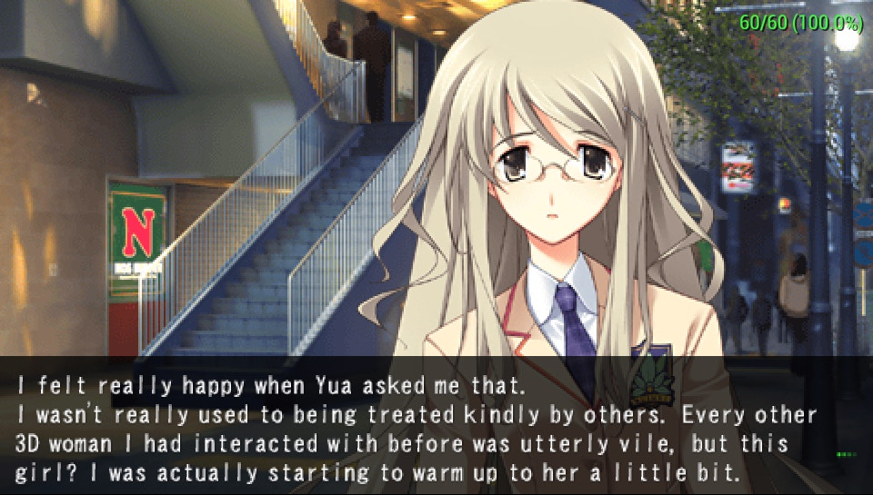
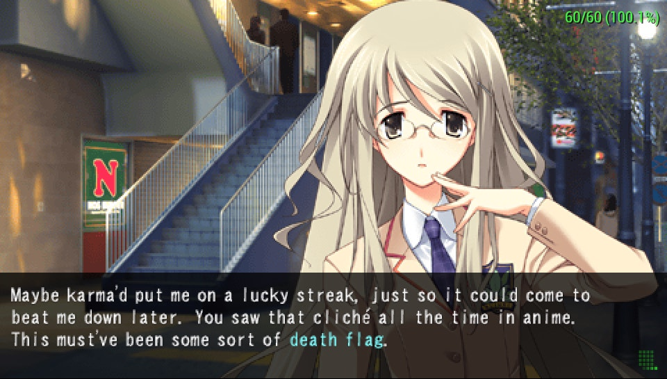

# Chaos;Head Noah [PSP] - English Patch

*“Whose eyes are those eyes?”*

Un parche para Chaos;Head Noah de PSP al inglés.

(Se está probando tanto en PPSSPP como en una PSVita bajo Adrenaline v7)

## Cambios

- 60FPS --- (Probado igualmente en CWCheat)

```
_S ULJM-05692
_G Chaos;Head Noah [Japan]
_C1 60 FPS Patch (Chaos;Head Noah)
_L 0x200EC508 0x00000000
```

- Fuente de letras reducida (16px ---> 14px)

- Ahora 4 líneas por pantalla (caja de texto)

## Créditos

- HaselLoyance

Por su parche de Steins;Gate al inglés para PSP: [steins-gate-psp-patch](https://github.com/yar-sh/steins-gate-psp-patch)

Así como la documentación proporcionada, la cual fue de mucha ayuda para entender a cómo manejar los archivos.

E igualmente por la herramienta [topographer](https://github.com/yar-sh/criware-tools/tree/master/topographer), que permite extraer y volver a comprimir los scripts del juego.

- RikuKH3

Por hacer varias de las herramientas que se utilizan en este proyecto.

KLZTools, P2Tools... así como "Corpse Party BOS Translation Tools"

Permitiendo modificar varios de los archivos de la versión de PSP.

- RealGOSC 

Por su guía de extracción de imágenes: [Chaos;Head Sprite Ripping](https://randomthingwhy.neocities.org/stuff/052924_chaoshead)

El cual abarca tanto PC como PSP. Así como recomendar nuevas opciones en herramientas.

 Y por archivar "Corpse Party BOS Translation Tools", el cual no podía encontrar por ningún lado.

 - hrydgard

 Por el emulador [PPSSPP](https://github.com/hrydgard/ppsspp), el cual permite hacer pruebas rápidas y modificar los datos binarios del EBOOT.BIN en tiempo real.

- CommitteeOfZero

Por trabajar en la traducción original en la que se basa este proyecto: [Chaos;Head Noah Steam/GOG](https://github.com/CommitteeOfZero/chn-patch)

Al igual que las herramientas necesarias para extraer los recursos de la versión de PC.

De aquí sale todo lo que ves traducido: imágenes, textos...

-------

Muchas gracias a todos por sus aportes a la comunidad, gracias a ello, es posible realizar esto.

## Problemas conocidos (mínimos)

- El Backlog maneja un margen de espacio diferente al que se tiene in-game, lo que termina ocasionando palabras cortadas. <br>
E igualmente, todos los textos no llevan un margen de espacio adecuado (texto 1 -> texto 2), por lo que están pegados.

## Screenshots
 

 

 

 

 
